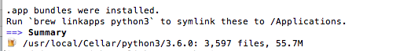

## 概述
Python下有许多款不同的 Web 框架。Django是重量级选手中最有代表性的一位。许多成功的网站和APP都基于Django。
Django是一个开放源代码的Web应用框架，由Python写成。
Django遵守BSD版权，初次发布于2005年7月, 并于2008年9月发布了第一个正式版本1.0 。
Django采用了MVC的软件设计模式，即模型M，视图V和控制器C。

Django 版本对应的 Python 版本：

| Djiango版本  | python版本 |
| --- | --- |
| 1.8 | 2.7, 3.2 , 3.3, 3.4, 3.5 |
| 1.9，1.10 | 2.7, 3.4, 3.5 |
| 1.11 | 2.7, 3.4, 3.5, 3.6 |
| 2.0 | 3.5+ |

<!--more-->

## 安装

### python 安装

Mac环境下默认带有python环境，但我们最好统一选择python3进行安装使用，如python3以安装好，请跳过此步骤。

推荐使用Homebrew安装：

命令：
`brew install python3`

完成后提示


### Django 安装

如果使用上面brew安装了python的话，就会默认吧pip安装好。
并且安装django使用pip非常简易，命令如下：

```
pip3 install Django
```

安装成功后，我们可以使用：
import django
如果没有错误，Django安装成功。


## Django使用

### 创建项目

使用 django-admin.py 来创建 HelloWorld 项目：

`django-admin.py startproject HelloWorld`

创建完成后我们可以得到以下项目的目录结构：

```
|-- HelloWorld
|   |-- __init__.py
|   |-- settings.py
|   |-- urls.py
|   `-- wsgi.py
`-- manage.py
```

目录说明：

- HelloWorld: 项目的容器。
- manage.py: 一个实用的命令行工具，可让你以各种方式与该 Django 项目进行交互。
- HelloWorld/__init__.py: 一个空文件，告诉 Python 该目录是一个 Python 包。
- HelloWorld/settings.py: 该 Django 项目的设置/配置。
- HelloWorld/urls.py: 该 Django 项目的 URL 声明; 一份由 Django 驱动的网站"目录"。
- HelloWorld/wsgi.py: 一个 WSGI 兼容的 Web 服务器的入口，以便运行你的项目。

启动项目：

`python3 manage.py runserver`

启动默认为8000端口，也可以自己再启动命令后加上指定端口

在浏览器输入你服务器的ip及端口号，如果正常启动，输出结果如下：
 
 
### Django 模型
 
Django 对各种数据库提供了很好的支持，包括：PostgreSQL、MySQL、SQLite、Oracle。这里我们选取mysql。

#### 数据库配置

我们在项目的 settings.py 文件中找到 DATABASES 配置项，将其信息修改为：
文件位置：HelloWorld/HelloWorld/settings.py
```
DATABASES = {
    'default': {
        'ENGINE': 'django.db.backends.mysql',  
        'NAME': 'test',
        'USER': 'test',
        'PASSWORD': 'test123',
        'HOST':'localhost',
        'PORT':'3306',
    }
}
```

#### 创建模型

运行命令创建model
`django-admin.py startapp TestModel`

创建好的model目录结构如下

```
HelloWorld
|-- TestModel
|   |-- __init__.py
|   |-- admin.py
|   |-- models.py
|   |-- tests.py
|   `-- views.py
```

在models.py文件中编写具体的实体对象


```
from django.db import models
 
class User(models.Model):
    name = models.CharField(max_length=20)
    gender = models.BigIntegerField()
    remark = models.TextFiled(null=True)
    crated_at = models.DateTimeField(auto_now_add=True)
    
    class Meta:
        db_table = 'user'   # 为表指定名字，默认的话会加上model前缀
```
id字段如果不写的话，框架会默认加上

[Model字段如何定义](https://docs.djangoproject.com/en/2.0/ref/models/fields/)

接下来我们需要根据写好的实体对象生成对应的数据库表结构

(1)  接下来在settings.py中找到INSTALLED_APPS这一项，如下：

```INSTALLED_APPS = (
    'django.contrib.admin',
    'django.contrib.auth',
    'django.contrib.contenttypes',
    'django.contrib.sessions',
    'django.contrib.messages',
    'django.contrib.staticfiles',
    'TestModel',               # 添加此项
)
```

(2) 在命令行中运行：

  
``` 
$ python manage.py makemigrations TestModel  # 让 Django 知道我们在我们的模型有一些变更
$ python manage.py migrate TestModel   # 创建表结构
```

#### 数据库操作
[Django ORM 查询](https://docs.djangoproject.com/en/2.0/topics/db/queries/)

实例：


```
from django.http import HttpResponse
 
from TestModel.models import Test
 
# 数据库操作
def test_db(request):
    # 添加
    user = User(name='somebody',gender=0)
    user.save()
    
    # 查询
    user= User.objects.get(id = 1)  # 如果该条数据不存在会抛错误
    UserList= User.objects.filter(name = 'somebody')    # 得到该对象的list
    
    # 排序
    UserList= User.objects.filter(name = 'somebody').order_by('created_at')   #按照创建时间正序    
    UserList= User.objects.filter(name = 'somebody').order_by('-created_at')    #按照创建时间正序
    
    # 按时间查找，改ORM提供了按年、月、日...查询过滤
    UserList= User.objects.filter(created_at__year = 2018)    #查找2018年的创建的数据
    
    # 限制返回的数据 相当于 SQL 中的 OFFSET 0 LIMIT 2; 可以用来分页查询
    Test.objects.order_by('name')[0:2]
    .
    .
    .
    .
     
    return HttpResponse("操作数据库成功")
```

