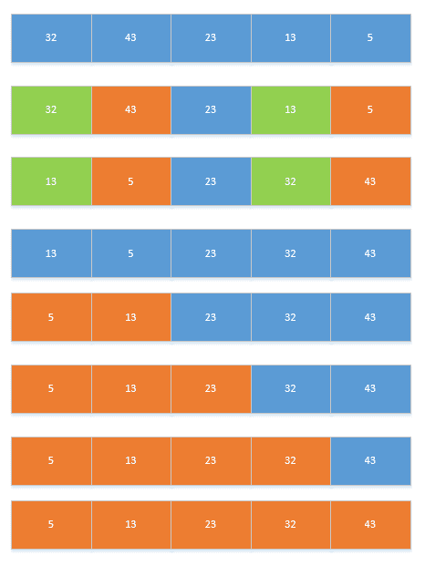
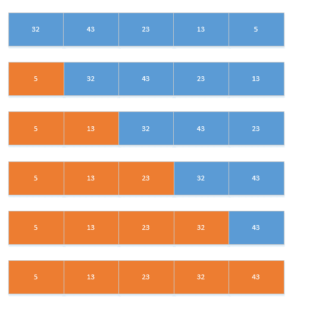
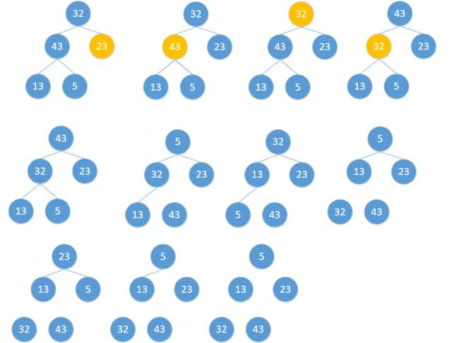
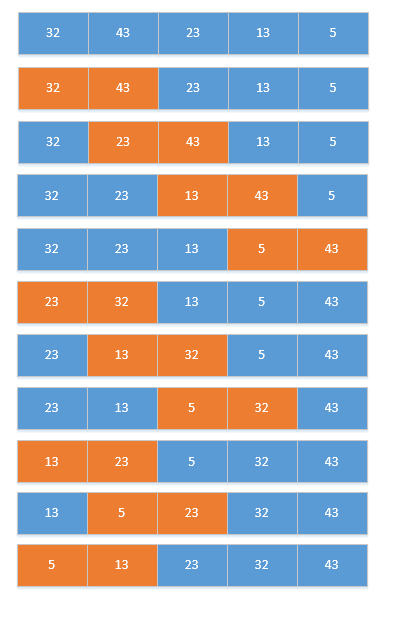
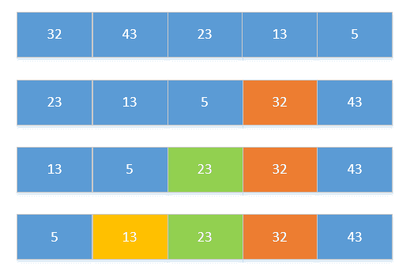
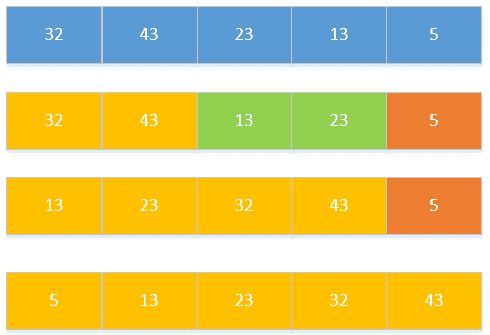

排序这个问题一直都是面试的重点，工作中也有时候会用到吧，这里记录一下8中基本排序算法以及代码。


[视觉感受各种算法的排序过程，感觉有点意思，可以戳一戳](http://blog.jobbole.com/11745/)

<!--more-->

## 1.直接插入排序

 把新的数据插入到已经排好的数据列中。将第一个数和第二个数排序，然后构成一个有序序列将第三个数插入进去，构成一个新的有序序列。对第四个数、第五个数……直到最后一个数，重复第二步。
如图所示：

 
 
 **代码：**
 
```public void insertSort(int[] a) {
        int len = a.length;//单独把数组长度拿出来，提高效率
        int insertNum;//要插入的数
        for (int i = 1; i < len; i++) {//因为第一次不用，所以从1开始
            insertNum = a[i];
            int j = i - 1;//序列元素个数
            while (j > 0 && a[j] > insertNum) {//从后往前循环，将大于insertNum的数向后移动
                a[j + 1] = a[j];//元素向后移动
                j--;
            }
            a[j + 1] = insertNum;//找到位置，插入当前元素
        }
    }
```
 
## 2.希尔排序

针对直接插入排序的下效率问题，有人对次进行了改进与升级，这就是现在的希尔排序。希尔排序，也称递减增量排序算法，是插入排序的一种更高效的改进版本。希尔排序是非稳定排序算法。

希尔排序是基于插入排序的以下两点性质而提出改进方法的：

插入排序在对几乎已经排好序的数据操作时， 效率高， 即可以达到线性排序的效率
但插入排序一般来说是低效的， 因为插入排序每次只能将数据移动一位
如图所示：
 

对于直接插入排序问题，数据量巨大时。
将数的个数设为n，取奇数k=n/2，将下标差值为k的数分为一组，构成有序序列。
再取k=k/2 ，将下标差值为k的书分为一组，构成有序序列。
重复第二步，直到k=1执行简单插入排序。 

**代码:**

```
public void sheelSort(int[] a) {
        int len = a.length;//单独把数组长度拿出来，提高效率
        while (len != 0) {
            len = len / 2;
            for (int i = 0; i < len; i++) {//分组
                for (int j = i + len; j < a.length; j += len) {//元素从第二个开始
                    int k = j - len;//k为有序序列最后一位的位数
                    int temp = a[j];//要插入的元素
                                        /*for(;k>=0&&temp<a[k];k-=len){
                         a[k+len]=a[k];
                     }*/
                    while (k >= 0 && temp < a[k]) {//从后往前遍历
                        a[k + len] = a[k];
                        k -= len;//向后移动len位
                    }
                    a[k + len] = temp;
                }
            }
        }
    }
```

## 3.选择排序

遍历整个序列，将最小的数放在最前面。
遍历剩下的序列，将最小的数放在最前面。
重复第二步，直到只剩下一个数。
如图：


 
**代码：**

```
public void selectSort(int[]a){
        int len=a.length;
        for(int i=0;i<len;i++){//循环次数
            int value=a[i];
            int position=i;
            for(int j=i+1;j<len;j++){//找到最小的值和位置
                if(a[j]<value){
                    value=a[j];
                    position=j;
                }
            }
            a[position]=a[i];//进行交换
            a[i]=value;
        }
    }
```
## 4.堆排序

对选择排序的优化。
将序列构建成大顶堆。
将根节点与最后一个节点交换，然后断开最后一个节点。
重复第一、二步，直到所有节点断开。


 
**代码：**
  
```
public  void heapSort(int[] a){
           int len=a.length;
           //循环建堆  
           for(int i=0;i<len-1;i++){
               //建堆  
               buildMaxHeap(a,len-1-i);
               //交换堆顶和最后一个元素  
               swap(a,0,len-1-i);
           }
       }
        //交换方法
       private  void swap(int[] data, int i, int j) {
           int tmp=data[i];
           data[i]=data[j];
           data[j]=tmp;
       }
       //对data数组从0到lastIndex建大顶堆  
       private void buildMaxHeap(int[] data, int lastIndex) {
           //从lastIndex处节点（最后一个节点）的父节点开始  
           for(int i=(lastIndex-1)/2;i>=0;i--){
               //k保存正在判断的节点  
               int k=i;
               //如果当前k节点的子节点存在  
               while(k*2+1<=lastIndex){
                   //k节点的左子节点的索引  
                   int biggerIndex=2*k+1;
                   //如果biggerIndex小于lastIndex，即biggerIndex+1代表的k节点的右子节点存在  
                   if(biggerIndex<lastIndex){
                       //若果右子节点的值较大  
                       if(data[biggerIndex]<data[biggerIndex+1]){
                           //biggerIndex总是记录较大子节点的索引  
                           biggerIndex++;
                       }
                   }
                   //如果k节点的值小于其较大的子节点的值  
                   if(data[k]<data[biggerIndex]){
                       //交换他们  
                       swap(data,k,biggerIndex);
                       //将biggerIndex赋予k，开始while循环的下一次循环，重新保证k节点的值大于其左右子节点的值  
                       k=biggerIndex;
                   }else{
                       break;
                   }
               }
           }
       }
```


## 5.冒泡排序

将序列中所有元素两两比较，将最大的放在最后面。
将剩余序列中所有元素两两比较，将最大的放在最后面。
重复第二步，直到只剩下一个数。

 
 
 **代码：**

```
public void bubbleSort(int []a){
           int len=a.length;
           for(int i=0;i<len;i++){
               for(int j=0;j<len-i-1;j++){//注意第二重循环的条件
                   if(a[j]>a[j+1]){
                       int temp=a[j];
                       a[j]=a[j+1];
                       a[j+1]=temp;
                   }
               }
           }
       }
```

## 6.快速排序
时间最快
选择第一个数为 key，小于 key 的数放在左边，大于 key 的数放在右边。
递归的将 key 左边和右边的数都按照第一步进行，直到不能递归。


 
**代码：**

```
public void quickSort(int[]a,int start,int end){
           if(start<end){
               int baseNum=a[start];//选基准值
               int midNum;//记录中间值
               int i=start;
               int j=end;
               do{
                   while((a[i]<baseNum)&&i<end){
                       i++;
                   }
                   while((a[j]>baseNum)&&j>start){
                       j--;
                   }
                   if(i<=j){
                       midNum=a[i];
                       a[i]=a[j];
                       a[j]=midNum;
                       i++;
                       j--;
                   }
               }while(i<=j);
                if(start<j){
                    quickSort(a,start,j);
                }       
                if(end>i){
                    quickSort(a,i,end);
                }
           }
       }
```

## 7.归并排序

速度仅次于快速排序，内存少的时候使用，可以进行并行计算的时候使用。
选择相邻两个数组成一个有序序列。
选择相邻的两个有序序列组成一个有序序列。
重复第二步，直到全部组成一个有序序列。


 
**代码：**

```
public  void mergeSort(int[] a, int left, int right) {  
           int t = 1;// 每组元素个数  
           int size = right - left + 1;  
           while (t < size) {  
               int s = t;// 本次循环每组元素个数  
               t = 2 * s;  
               int i = left;  
               while (i + (t - 1) < size) {  
                   merge(a, i, i + (s - 1), i + (t - 1));  
                   i += t;  
               }  
               if (i + (s - 1) < right)  
                   merge(a, i, i + (s - 1), right);  
           }  
        }  
       
        private static void merge(int[] data, int p, int q, int r) {  
           int[] B = new int[data.length];  
           int s = p;  
           int t = q + 1;  
           int k = p;  
           while (s <= q && t <= r) {  
               if (data[s] <= data[t]) {  
                   B[k] = data[s];  
                   s++;  
               } else {  
                   B[k] = data[t];  
                   t++;  
               }  
               k++;  
           }  
           if (s == q + 1)  
               B[k++] = data[t++];  
           else  
               B[k++] = data[s++];  
           for (int i = p; i <= r; i++)  
               data[i] = B[i];  
        }
```

## 8.基数排序

用于大量数，很长的数进行排序时。
将所有的数的个位数取出，按照个位数进行排序，构成一个序列。
将新构成的所有的数的十位数取出，按照十位数进行排序，构成一个序列。

**代码：**

```
public void baseSort(int[] a) {
               //首先确定排序的趟数;    
               int max = a[0];
               for (int i = 1; i < a.length; i++) {
                   if (a[i] > max) {
                       max = a[i];
                   }
               }
               int time = 0;
               //判断位数;    
               while (max > 0) {
                   max /= 10;
                   time++;
               }
               //建立10个队列;    
               List<ArrayList<Integer>> queue = new ArrayList<ArrayList<Integer>>();
               for (int i = 0; i < 10; i++) {
                   ArrayList<Integer> queue1 = new ArrayList<Integer>();
                   queue.add(queue1);
               }
               //进行time次分配和收集;    
               for (int i = 0; i < time; i++) {
                   //分配数组元素;    
                   for (int j = 0; j < a.length; j++) {
                       //得到数字的第time+1位数;  
                       int x = a[j] % (int) Math.pow(10, i + 1) / (int) Math.pow(10, i);
                       ArrayList<Integer> queue2 = queue.get(x);
                       queue2.add(a[j]);
                       queue.set(x, queue2);
                   }
                   int count = 0;//元素计数器;    
                   //收集队列元素;    
                   for (int k = 0; k < 10; k++) {
                       while (queue.get(k).size() > 0) {
                           ArrayList<Integer> queue3 = queue.get(k);
                           a[count] = queue3.get(0);
                           queue3.remove(0);
                           count++;
                       }
                   }
               }
        }
```

## 排序算法总结

**一、稳定性:**

- 稳定：冒泡排序、插入排序、归并排序和基数排序
- 不稳定：选择排序、快速排序、希尔排序、堆排序

**二、平均时间复杂度**

- O(n^2):直接插入排序，简单选择排序，冒泡排序。
- 在数据规模较小时（9W内），直接插入排序，简单选择排序差不多。当数据较大时，冒泡排序算法的时间代价最高。性能为O(n^2)的算法基本上是相邻元素进行比较，基本上都是稳定的。
- O(nlogn):快速排序，归并排序，希尔排序，堆排序。
- 其中，快排是最好的， 其次是归并和希尔，堆排序在数据量很大时效果明显。

**三、排序算法的选择**

1、 数据规模较小

- 待排序列基本序的情况下，可以选择直接插入排序；
- 对稳定性不作要求宜用简单选择排序，对稳定性有要求宜用插入或冒泡

2、 数据规模不是很大

- 完全可以用内存空间，序列杂乱无序，对稳定性没有要求，快速排序，此时要付出log（N）的额外空间。
- 序列本身可能有序，对稳定性有要求，空间允许下，宜用归并排序

3、 数据规模很大

- 对稳定性有求，则可考虑归并排序。
- 对稳定性没要求，宜用堆排序

4、 序列初始基本有序（正序），宜用直接插入，冒泡

