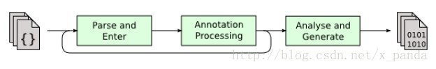
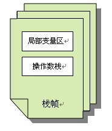

## 前言

java虚拟机学习相关，一直在用jvm，结果还是不甚理解，所以特此总结整理一下，也不负jvm每日辛苦的work。

<!--more-->

## java虚拟机简析

java虚拟机（Java Virtual Machine），一般简写为jvm。虚拟机顾名思义，也就是虚构出来的计算机，是通过在实际计算机上仿真模拟各种计算机功能来实现的。
而我们知道java语言是一门与平台无关的编程语言，其中jvm就是实现这一特点的关键。一般高级语言在不同的平台上运行，就需要根据不同的平台来编译成不同的目标代码，而有了jvm则我们只需要统一编译成能在jvm上运行的目标代码就可以了，针对不同平台的编译，就交给jvm去处理了。

## java代码编译执行的过程

撸代码的我，有时候也在想我们写这个这个java文件到底是怎么跑起来的呢，它到底都经历了什么过程？
下面我们就来解惑吧：
Java代码的编译和执行的整个过程大概是：开发人员编写Java代码(.java文件)，然后将之编译成字节码(.class文件)，再然后字节码被装入内存，一旦字节码进入虚拟机，它就会被解释器解释执行，或者是被即时代码发生器有选择的转换成机器码执行。
（1）Java代码编译是由Java源码编译器来完成，也就是Java代码到JVM字节码（.class文件）的过程。 流程图如下所示：

（2）Java字节码的执行是由JVM执行引擎来完成，流程图如下所示：

Java代码编译和执行的整个过程包含了以下三个重要的机制:

- Java源码编译机制
- 类加载机制
- 类执行机制

### Java源码编译机制
Java 源码编译由以下三个过程组成：

- 分析和输入到符号表
- 注解处理
- 语义分析和生成class文件

流程图如下所示：

最后生成的class文件由以下部分组成：

- 结构信息：包括class文件格式版本号及各部分的数量与大小的信息
- 元数据：对应于Java源码中声明与常量的信息。包含类/继承的超类/实现的接口的声明信息、域与方法声明信息和常量池
- 方法信息：对应Java源码中语句和表达式对应的信息。包含字节码、异常处理器表、求值栈与局部变量区大小、求值栈的类型记录、调试符号信息

### 类加载机制

JVM的类加载是通过ClassLoader及其子类来完成的，类的层次关系和加载顺序可以由下图来描述：

#### Bootstrap ClassLoader

负责加载$JAVA_HOME中jre/lib/rt.jar里所有的class，由C++实现，不是ClassLoader子类

#### Extension ClassLoader

负责加载java平台中扩展功能的一些jar包，包括$JAVA_HOME中jre/lib/*.jar或-Djava.ext.dirs指定目录下的jar包

#### App ClassLoader

负责记载classpath中指定的jar包及目录中class

#### Custom ClassLoader

属于应用程序根据自身需要自定义的ClassLoader，如tomcat、jboss都会根据j2ee规范自行实现ClassLoader

加载过程中会先检查类是否被已加载，检查顺序是自底向上，从Custom ClassLoader到BootStrap ClassLoader逐层检查，只要某个classloader已加载就视为已加载此类，保证此类只所有ClassLoader加载一次。而加载的顺序是自顶向下，也就是由上层来逐层尝试加载此类。

### 类执行机制

JVM是基于堆栈的虚拟机。JVM为每个新创建的线程都分配一个堆栈.也就是说,对于一个Java程序来说，它的运行就是通过对堆栈的操作来完成的。堆栈以帧为单位保存线程的状态。JVM对堆栈只进行两种操作:以帧为单位的压栈和出栈操作。

JVM执行class字节码，线程创建后，都会产生程序计数器（PC）和栈（Stack），程序计数器存放下一条要执行的指令在方法内的偏移量，栈中存放一个个栈帧，每个栈帧对应着每个方法的每次调用，而栈帧又是有局部变量区和操作数栈两部分组成，局部变量区用于存放方法中的局部变量和参数，操作数栈中用于存放方法执行过程中产生的中间结果。栈的结构如下图所示：

## java内存模型（jmm）

下图展示了JVM的主要结构：

可以看出，JVM主要由类加载器子系统、运行时数据区（内存空间）、执行引擎以及与本地方法接口等组成。其中运行时数据区又由方法区、堆、Java栈、PC寄存器、本地方法栈组成。

java栈、pc寄存器、本地方法区，是线程独占的;
堆、方法区是线程共享的。

### java栈（虚拟机栈）

Java栈由栈帧组成，一个帧对应一个方法调用。调用方法时压入栈帧，方法返回时弹出栈帧并抛弃。Java栈的主要任务是存储方法参数、局部变量、中间运算结果，并且提供部分其它模块工作需要的数据。前面已经提到Java栈是线程私有的，这就保证了线程安全性，使得程序员无需考虑栈同步访问的问题，只有线程本身可以访问它自己的局部变量区。

它分为三部分：局部变量区、操作数栈、帧数据区。

#### 局部变量区

局部变量区是以字长为单位的数组，在这里，byte、short、char类型会被转换成int类型存储，除了long和double类型占两个字长以外，其余类型都只占用一个字长。特别地，boolean类型在编译时会被转换成int或byte类型，boolean数组会被当做byte类型数组来处理。局部变量区也会包含对象的引用，包括类引用、接口引用以及数组引用。

局部变量区包含了方法参数和局部变量，此外，实例方法隐含第一个局部变量this，它指向调用该方法的对象引用。对于对象，局部变量区中永远只有指向堆的引用。

#### 操作数栈

操作数栈也是以字长为单位的数组，但是正如其名，它只能进行入栈出栈的基本操作。在进行计算时，操作数被弹出栈，计算完毕后再入栈。

#### 帧数据区

帧数据区的任务主要有：

a.记录指向类的常量池的指针，以便于解析。

b.帮助方法的正常返回，包括恢复调用该方法的栈帧，设置PC寄存器指向调用方法对应的下一条指令，把返回值压入调用栈帧的操作数栈中。

c.记录异常表，发生异常时将控制权交由对应异常的catch子句，如果没有找到对应的catch子句，会恢复调用方法的栈帧并重新抛出异常。

### 本地方法栈

本地方法栈类似于Java栈，主要存储了本地方法调用的状态。在Sun JDK中，本地方法栈和Java栈是同一个。

### pc寄存器（程序计数器）

PC 指当前指令（或操作码）的地址，本地指令除外。如果当前方法是 native 方法，那么PC 的值为 undefined。所有的 CPU 都有一个 PC，典型状态下，每执行一条指令 PC 都会自增，因此 PC 存储了指向下一条要被执行的指令地址。JVM 用 PC 来跟踪指令执行的位置，PC 将实际上是指向方法区（Method Area）的一个内存地址。

### 方法区

**类型信息**和**类的静态变量**都存储在方法区中。

方法区中对于每个类存储了以下数据：

- 类及其父类的全限定名（java.lang.Object没有父类）
- 类的类型（Class or Interface）
- 访问修饰符（public, abstract, final）
- 实现的接口的全限定名的列表
- 常量池
- 字段信息
- 方法信息
- 静态变量
- ClassLoader引用
- Class引用

可见类的所有信息都存储在方法区中。由于方法区是所有线程共享的，所以必须保证线程安全，举例来说，如果两个类同时要加载一个尚未被加载的类，那么一个类会请求它的ClassLoader去加载需要的类，另一个类只能等待而不会重复加载。

此外为了加快调用方法的速度，通常还会为每个非抽象类创建私有的方法表，方法表是一个数组，存放了实例可能被调用的实例方法的直接引用。方法表对于多态有非常重要的意义，具体可以参照[《浅谈多态机制的意义及实现》](http://blog.hesey.net/2010/12/significance-and-implementation-of-polymorphism.html)一文中“多态的实现”一节。

在Sun JDK中，方法区对应了持久代（Permanent Generation），默认最小值为16MB，最大值为64MB。

### 堆

堆用于存储**对象实例**以及**数组值**。

堆中有指向类数据的指针，该指针指向了方法区中对应的类型信息。堆中还可能存放了指向方法表的指针。堆是所有线程共享的，所以在进行实例化对象等操作时，需要解决同步问题。此外，堆中的实例数据中还包含了对象锁，并且针对不同的垃圾收集策略，可能存放了引用计数或清扫标记等数据。

在堆的管理上，Sun JDK从1.2版本开始引入了分代管理的方式。主要分为新生代、旧生代。分代方式大大改善了垃圾收集的效率。

#### 新生代（New Generation）

大多数情况下新对象都被分配在新生代中，新生代由Eden Space和两块相同大小的Survivor Space组成，后两者主要用于Minor GC时的对象复制（Minor GC的过程在此不详细讨论）。

JVM在Eden Space中会开辟一小块独立的TLAB（Thread Local Allocation Buffer）区域用于更高效的内存分配，我们知道在堆上分配内存需要锁定整个堆，而在TLAB上则不需要，JVM在分配对象时会尽量在TLAB上分配，以提高效率。

#### 年老代（Old Generation/Tenuring Generation）

在新生代中存活时间较久的对象将会被转入旧生代，旧生代进行垃圾收集的频率没有新生代高。

## GC 垃圾回收机制

### GC是什么？为什么要有GC？

GC是垃圾收集的意思（Gabage Collection）,内存处理是编程人员容易出现问题的地方，忘记或者错误的内存回收会导致程序或系统的不稳定甚至崩溃，Java提供的GC功能可以自动监测对象是否超过作用域从而达到自动回收内存的目的，Java语言没有提供释放已分配内存的显示操作方法。

### 垃圾回收的优点和原理。并考虑2种回收机制

Java语言中一个显著的特点就是引入了垃圾回收机制，使c++程序员最头疼的内存管理的问题迎刃而解，它使得Java程序员在编写程序的时候不再需要考虑内存管理。由于有个垃圾回收机制，Java中的对象不再有"作用域"的概念，只有对象的引用才有"作用域"。垃圾回收可以有效的防止内存泄露，有效的使用可以使用的内存。垃圾回收器通常是作为一个单独的低级别的线程运行，不可预知的情况下对内存堆中已经死亡的或者长时间没有使用的对象进行清楚和回收，程序员不能实时的调用垃圾回收器对某个对象或所有对象进行垃圾回收。回收机制有分代复制垃圾回收和标记垃圾回收，增量垃圾回收。

### GC的类型

当每个代满了之后都会自动促发collection，各收集器触发的条件不一样，当然也可以通过一些参数进行强制设定。主要分为两种类型：

#### Minor Collection：

GC用较高的频率对young进行扫描和回收，采用复制算法。

#### Major Collection：

同时对Young和Old进行内存收集，也叫Full GC；因为成本关系对Old的检查回收频率要比Young低很多，采用标记清除/标记整理算法。可以通过调用代码System.gc()引发major collection，使用-XX:+DisableExplicitGC禁止它，或设为CMS并发 -XX:+ExplicitGCInvokesConcurrent。

更为具体的阐述如下： 由于年轻代进进出出的人多而频繁，所以年轻代的GC也就频繁一点，但涉及范围也就年轻代这点弹丸之地内的对象，其特点就是少量，多次，但快速，称之为 Minor Collection。当年轻代的内存使用达到一定的阀值时，Minor Collection就被触发，Eden及某一Survior space（from space）之内存活的的对象被移到另一个空的Survior space（to space）中，然后from space和to space角色对调。当一个对象在两个survivor space之间移动过一定次数（达到预设的阀值）时，它就足够old了，够资格呆在年老代了。当然，如果survivor space比较小不足以容下所有live objects时，部分live objects也会直接晋升到年老代。 Survior spaces可以看作是Eden和年老代之间的缓冲，通过该缓冲可以检验一个对象生命周期是否足够的长，因为某些对象虽然逃过了一次Minor Collection，并不能说明其生命周期足够长，说不定在下一次Minor Collection之前就挂了。这样一定程度上确保了进入年老代的对象是货真价实的，减少了年老代空间使用的增长速度，也就降低年老代GC的频率。 当年老代或者永久代的内存使用达到一定阀值时，一次基于所有代的GC就触发了，其特定是涉及范围广（量大），耗费的时间相对较长（较慢），但是频率比较低（次数少），称之为Major Collection(Full Collection)。通常，首先使用针对年轻代的GC算法进行年轻代的GC，然后使用针对年老代的GC算法对年老代和永久代进行GC。

### 基本回收算法

#### 引用计数（Reference Counting）

比较古老的回收算法。原理是此对象有一个引用，即增加一个计数，删除一个引用则减少一个计数。垃圾回收时，只用收集计数为0的对象。此算法最致命的是无法处理循环引用的问题。

#### 标记-清除（Mark-Sweep）

此算法执行分两阶段。第一阶段从引用根节点开始标记所有被引用的对象，第二阶段遍历整个堆，把未标记的对象清除。此算法需要暂停整个应用，同时，会产生内存碎片。

#### 复制（Copying）

此算法把内存空间划为两个相等的区域，每次只使用其中一个区域。垃圾回收时，遍历当前使用区域，把正在使用中的对象复制到另外一个区域中。次算法每次只处理正在使用中的对象，因此复制成本比较小，同时复制过去以后还能进行相应的内存整理，不过出现“碎片”问题。当然，此算法的缺点也是很明显的，就是需要两倍内存空间。

#### 标记-整理（Mark-Compact）

此算法结合了 “标记-清除”和“复制”两个算法的优点。也是分两阶段，第一阶段从根节点开始标记所有被引用对象，第二阶段遍历整个堆，把清除未标记对象并且把存活对象 “压缩”到堆的其中一块，按顺序排放。此算法避免了“标记-清除”的碎片问题，同时也避免了“复制”算法的空间问题。

#### 增量收集（Incremental Collecting）

实施垃圾回收算法，即：在应用进行的同时进行垃圾回收。不知道什么原因JDK5.0中的收集器没有使用这种算法的。

### 垃圾回收器

目前的收集器主要有三种：串行收集器、并行收集器、并发收集器。

#### 串行收集器 

使用单线程处理所有垃圾回收工作，因为无需多线程交互，所以效率比较高。但是，也无法使用多处理器的优势，所以此收集器适合单处理器机器。当然，此收集器也可以用在小数据量（100M左右）情况下的多处理器机器上。可以使用-XX:+UseSerialGC打开。

#### 并行收集器

对年轻代进行并行垃圾回收，因此可以减少垃圾回收时间。一般在多线程多处理器机器上使用。使用-XX:+UseParallelGC.打开。并行收集器在J2SE5.0第六6更新上引入，在Java SE6.0中进行了增强--可以堆年老代进行并行收集。如果年老代不使用并发收集的话，是使用单线程进行垃圾回收，因此会制约扩展能力。使用-XX:+UseParallelOldGC打开。
使用-XX:ParallelGCThreads=设置并行垃圾回收的线程数。此值可以设置与机器处理器数量相等。
此收集器可以进行如下配置： 最大垃圾回收暂停:指定垃圾回收时的最长暂停时间，通过-XX:MaxGCPauseMillis=指定。为毫秒.如果指定了此值的话，堆大小和垃圾回收相关参数会进行调整以达到指定值。设定此值可能会减少应用的吞吐量。 吞吐量:吞吐量为垃圾回收时间与非垃圾回收时间的比值，通过-XX:GCTimeRatio=来设定，公式为1/（1+N）。例如，-XX:GCTimeRatio=19时，表示5%的时间用于垃圾回收。默认情况为99，即1%的时间用于垃圾回收。

#### 并发收集器

可以保证大部分工作都并发进行（应用不停止），垃圾回收只暂停很少的时间，此收集器适合对响应时间要求比较高的中、大规模应用。使用-XX:+UseConcMarkSweepGC打开。
并发收集器主要减少年老代的暂停时间，他在应用不停止的情况下使用独立的垃圾回收线程，跟踪可达对象。在每个年老代垃圾回收周期中，在收集初期并发收集器会对整个应用进行简短的暂停，在收集中还会再暂停一次。第二次暂停会比第一次稍长，在此过程中多个线程同时进行垃圾回收工作。
并发收集器使用处理器换来短暂的停顿时间。在一个N个处理器的系统上，并发收集部分使用K/N个可用处理器进行回收，一般情况下1<=K<=N/4。
在只有一个处理器的主机上使用并发收集器，设置为incremental mode模式也可获得较短的停顿时间。
浮动垃圾：由于在应用运行的同时进行垃圾回收，所以有些垃圾可能在垃圾回收进行完成时产生，这样就造成了“Floating Garbage”，这些垃圾需要在下次垃圾回收周期时才能回收掉。所以，并发收集器一般需要20%的预留空间用于这些浮动垃圾。
Concurrent Mode Failure：并发收集器在应用运行时进行收集，所以需要保证堆在垃圾回收的这段时间有足够的空间供程序使用，否则，垃圾回收还未完成，堆空间先满了。这种情况下将会发生“并发模式失败”，此时整个应用将会暂停，进行垃圾回收。
启动并发收集器：因为并发收集在应用运行时进行收集，所以必须保证收集完成之前有足够的内存空间供程序使用，否则会出现“Concurrent Mode Failure”。通过设置-XX:CMSInitiatingOccupancyFraction=指定还有多少剩余堆时开始执行并发收集

文章部分来源出处：
http://blog.hesey.net/2011/04/introduction-to-java-virtual-machine.html
http://blog.csdn.net/CSDN_980979768/article/details/47281037?locationNum=7&fps=1
https://github.com/ain5721/TestJava/blob/master/test/src/note/java_interview.md#垃圾回收的优点和原理并考虑2种回收机制

